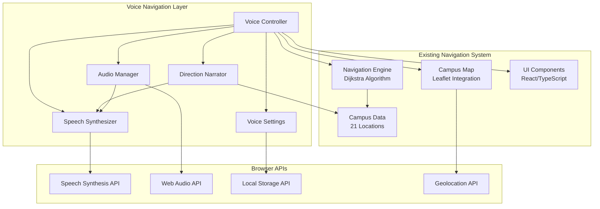

# Voice Navigation Technical Design Document

## Overview

The Voice Navigation feature adds comprehensive turn-by-turn voice guidance to the existing TASUED Campus Navigator system. This feature provides spoken directions, audio feedback, and voice controls to enhance accessibility and enable hands-free navigation while users walk between campus locations.

The system integrates seamlessly with the existing Next.js/React/TypeScript application, building upon the current Dijkstra-based pathfinding algorithm and 21-location campus data structure. The voice navigation layer operates as an audio overlay on the existing visual navigation system, providing synchronized voice guidance without disrupting the current user experience.

### Key Design Principles

- **Accessibility First**: Comprehensive audio feedback for users with visual impairments
- **Progressive Enhancement**: Voice features enhance but don't replace visual navigation
- **Browser Compatibility**: Graceful degradation across different browser capabilities
- **Performance Conscious**: Minimal memory footprint and responsive audio processing
- **Safety Focused**: Context-aware safety reminders and emergency controls

## Architecture

### System Architecture Overview

The Voice Navigation system follows a modular architecture with clear separation of concerns:



### Component Responsibilities

#### Voice Controller (VC)
- **Primary Interface**: Main orchestrator for all voice navigation functionality
- **State Management**: Manages voice navigation active/inactive states
- **UI Integration**: Provides voice control buttons and status indicators
- **Event Coordination**: Coordinates between voice components and existing navigation system

#### Direction Narrator (DN)
- **Instruction Generation**: Creates natural language turn-by-turn directions
- **Context Awareness**: Adapts instructions based on location types and landmarks
- **Safety Integration**: Includes safety reminders and contextual warnings
- **Timing Management**: Determines when to deliver instructions based on user progress

#### Speech Synthesizer (SS)
- **Text-to-Speech**: Converts instruction text to spoken audio
- **Voice Configuration**: Manages voice characteristics (gender, rate, pitch, volume)
- **Browser Compatibility**: Handles cross-browser speech synthesis differences
- **Queue Management**: Manages instruction delivery queue and interruptions

#### Audio Manager (AM)
- **Device Integration**: Detects and routes audio to appropriate output devices
- **Audio Ducking**: Manages background audio levels during voice prompts
- **Interruption Handling**: Manages audio interruptions from calls, notifications
- **Confirmation Sounds**: Plays audio cues for user actions and system events

#### Voice Settings (VS)
- **User Preferences**: Manages voice characteristics and behavior settings
- **Persistence**: Stores and retrieves user preferences from local storage
- **Real-time Updates**: Applies setting changes immediately with preview functionality
- **Accessibility Options**: Provides enhanced options for users with disabilities

## Components and Interfaces

### Voice Controller Interface

```typescript
interface VoiceController {
  // State Management
  isActive: boolean
  isPaused: boolean
  currentRoute: PathResult | null
  
  // Core Methods
  startVoiceNavigation(route: PathResult): Promise<boolean>
  pauseVoiceNavigation(): void
  resumeVoiceNavigation(): void
  stopVoiceNavigation(): void
  
  // Control Methods
  repeatLastInstruction(): void
  skipToNextInstruction(): void
  emergencyStop(): void
  
  // Event Handlers
  onRouteUpdate(route: PathResult): void
  onLocationUpdate(location: GeolocationPosition): void
  onNavigationComplete(): void
}
```

### Direction Narrator Interface

```typescript
interface DirectionNarrator {
  // Instruction Generation
  generateRouteInstructions(route: PathResult): VoiceInstruction[]
  generateTurnInstruction(fromLocation: CampusLocation, toLocation: CampusLocation): string
  generateApproachingInstruction(location: CampusLocation, distance: number): string
  generateArrivalInstruction(location: CampusLocation): string
  
  // Context-Aware Instructions
  addLandmarkInformation(instruction: string, location: CampusLocation): string
  addSafetyReminders(instruction: string, location: CampusLocation): string
  addDistanceInformation(instruction: string, distance: number): string
  
  // Instruction Delivery
  announceInstruction(instruction: VoiceInstruction): Promise<void>
  announceRouteOverview(route: PathResult): Promise<void>
}
```

### Speech Synthesizer Interface

```typescript
interface SpeechSynthesizer {
  // Initialization
  initialize(): Promise<boolean>
  isSupported(): boolean
  getAvailableVoices(): SpeechSynthesisVoice[]
  
  // Speech Control
  speak(text: string, options?: SpeechOptions): Promise<void>
  pause(): void
  resume(): void
  cancel(): void
  
  // Configuration
  setVoice(voice: SpeechSynthesisVoice): void
  setRate(rate: number): void
  setPitch(pitch: number): void
  setVolume(volume: number): void
  
  // Events
  onSpeechStart: (callback: () => void) => void
  onSpeechEnd: (callback: () => void) => void
  onSpeechError: (callback: (error: Error) => void) => void
}
```

### Audio Manager Interface

```typescript
interface AudioManager {
  // Device Management
  detectAudioDevices(): Promise<MediaDeviceInfo[]>
  routeAudioToDevice(deviceId: string): Promise<void>
  
  // Audio Control
  playConfirmationSound(type: 'start' | 'pause' | 'resume' | 'stop' | 'error'): Promise<void>
  duckBackgroundAudio(enable: boolean): void
  
  // Interruption Handling
  handlePhoneCall(active: boolean): void
  handleNotificationInterruption(): void
  
  // System Integration
  respectDoNotDisturb(): boolean
  checkAudioPermissions(): Promise<boolean>
}
```

## Data Models

### Voice Instruction Model

```typescript
interface VoiceInstruction {
  id: string
  type: 'turn' | 'approaching' | 'arrival' | 'overview' | 'safety' | 'confirmation'
  text: string
  location?: CampusLocation
  distance?: number
  priority: 'low' | 'normal' | 'high' | 'emergency'
  timestamp: number
  metadata?: {
    landmarks?: string[]
    safetyWarnings?: string[]
    estimatedTime?: number
  }
}
```

### Voice Settings Model

```typescript
interface VoiceSettings {
  // Voice Characteristics
  gender: 'male' | 'female' | 'neutral'
  rate: number // 0.5 to 2.0
  pitch: number // 0.5 to 2.0
  volume: number // 0.0 to 1.0
  
  // Language and Localization
  language: string // 'en-US', 'en-NG', etc.
  accent: string
  
  // Behavior Settings
  confirmationSounds: boolean
  safetyReminders: boolean
  landmarkAnnouncements: boolean
  distanceUnits: 'meters' | 'feet'
  
  // Accessibility Options
  verboseMode: boolean
  screenReaderCompatibility: boolean
  highContrastVisuals: boolean
  
  // Advanced Settings
  instructionTiming: 'early' | 'normal' | 'late'
  backgroundAudioDucking: boolean
  emergencyStopEnabled: boolean
}
```

### Navigation State Model

```typescript
interface VoiceNavigationState {
  // Current State
  isActive: boolean
  isPaused: boolean
  currentRoute: PathResult | null
  currentInstruction: VoiceInstruction | null
  
  // Progress Tracking
  completedWaypoints: number[]
  nextWaypoint: number | null
  distanceToNext: number
  estimatedTimeRemaining: number
  
  // User Context
  userLocation: GeolocationPosition | null
  movementSpeed: number // meters per second
  lastLocationUpdate: number
  
  // System Status
  speechSynthesizerReady: boolean
  audioDevicesAvailable: MediaDeviceInfo[]
  backgroundOperation: boolean
  
  // Error Handling
  lastError: Error | null
  retryCount: number
  fallbackMode: boolean
}
```

## Correctness Properties

*A property is a characteristic or behavior that should hold true across all valid executions of a system-essentially, a formal statement about what the system should do. Properties serve as the bridge between human-readable specifications and machine-verifiable correctness guarantees.*

### Property 1: Voice Navigation Activation

*For any* valid route calculated between two campus locations, the Voice_Controller SHALL display a "Start Voice Navigation" button and successfully initialize voice guidance when activated.

**Validates: Requirements 1.1, 1.2**

### Property 2: Turn Instruction Generation

*For any* route waypoint transition, the Direction_Narrator SHALL generate natural language instructions that include the destination location name and appropriate directional guidance.

**Validates: Requirements 2.1, 2.4**

### Property 3: Proximity Announcements

*For any* destination approach within 200 meters, the Direction_Narrator SHALL announce the approaching location using the format "You are approaching [Location Name]".

**Validates: Requirements 2.2**

### Property 4: Voice Settings Persistence

*For any* voice setting configuration, the Voice_Settings SHALL persist the preferences to local storage and restore them correctly across browser sessions.

**Validates: Requirements 3.7**

### Property 5: Speech Rate Adjustment

*For any* speech rate value between 0.5x and 2.0x, the Speech_Synthesizer SHALL apply the rate setting and produce audible speech at the specified speed.

**Validates: Requirements 3.2**

### Property 6: Audio Device Integration

*For any* available audio output device, the Audio_Manager SHALL detect the device and successfully route voice prompts when the device becomes active.

**Validates: Requirements 4.1, 4.2**

### Property 7: Voice Control Functionality

*For any* active voice navigation session, the Voice_Controller SHALL provide functional pause, resume, and repeat controls that correctly manage the speech synthesis state.

**Validates: Requirements 5.2, 5.3**

### Property 8: Accessibility Audio Descriptions

*For any* visual navigation element, the Voice_Navigation_System SHALL provide corresponding audio descriptions that convey the same information to users with visual impairments.

**Validates: Requirements 6.1**

### Property 9: Performance Initialization

*For any* supported browser environment, the Speech_Synthesizer SHALL initialize within 2 seconds and be ready to produce voice output.

**Validates: Requirements 7.1**

### Property 10: Navigation System Integration

*For any* route calculated by the existing Navigation_Engine, the Voice_Navigation_System SHALL automatically prepare corresponding turn instructions and maintain synchronization with visual route display.

**Validates: Requirements 8.1, 8.2**

### Property 11: Contextual Instruction Generation

*For any* campus location type (academic, administrative, facility, entrance), the Direction_Narrator SHALL generate contextually appropriate instructions that include relevant location-specific information.

**Validates: Requirements 9.1, 9.2**

### Property 12: Background Operation Continuity

*For any* browser tab focus change or screen lock event, the Voice_Navigation_System SHALL continue providing audio guidance where browser capabilities permit.

**Validates: Requirements 10.1, 10.2**

### Property 13: Audio Feedback Confirmation

*For any* voice navigation state change (start, pause, resume, stop), the Audio_Manager SHALL provide appropriate audio confirmation cues to inform the user of the system response.

**Validates: Requirements 11.1, 11.2**

### Property 14: Safety Warning Integration

*For any* navigation instruction, the Direction_Narrator SHALL include appropriate safety reminders and provide additional caution warnings when navigating near vehicle traffic areas.

**Validates: Requirements 12.1, 12.2**

## Error Handling

### Error Categories and Responses

#### Speech Synthesis Errors
- **Browser Incompatibility**: Graceful degradation to visual-only navigation with clear user notification
- **Voice Loading Failures**: Retry mechanism with fallback to default system voice
- **Audio Interruption**: Automatic pause and resume with user notification
- **Network-Dependent Voices**: Offline fallback to locally available voices

#### Audio Device Errors
- **Device Disconnection**: Automatic routing to available alternative devices
- **Permission Denied**: Clear user guidance for enabling audio permissions
- **Hardware Failures**: Fallback to visual navigation with error notification
- **Bluetooth Connectivity**: Retry mechanism with timeout and fallback

#### Navigation Integration Errors
- **Route Calculation Failures**: Voice system gracefully handles missing route data
- **Location Update Errors**: Continues with last known position and user notification
- **Map Synchronization Issues**: Voice navigation continues independently with warning
- **Data Inconsistency**: Validation and error recovery for campus data mismatches

#### User Experience Error Handling
- **Settings Corruption**: Reset to default settings with user notification
- **Local Storage Failures**: In-memory fallback for session-only preferences
- **Performance Degradation**: Automatic quality reduction with user option to restore
- **Emergency Situations**: Immediate audio stop with clear visual indicators

### Error Recovery Strategies

```typescript
interface ErrorRecoveryStrategy {
  // Automatic Recovery
  retryWithBackoff(operation: () => Promise<void>, maxRetries: number): Promise<boolean>
  fallbackToVisualNavigation(): void
  resetToDefaultSettings(): void
  
  // User-Guided Recovery
  promptUserForPermissions(): Promise<boolean>
  offerAlternativeDevices(devices: MediaDeviceInfo[]): Promise<string>
  suggestBrowserUpdate(): void
  
  // Graceful Degradation
  enableReducedFunctionality(): void
  provideFallbackInstructions(): void
  maintainCoreNavigation(): void
}
```

## Testing Strategy

### Dual Testing Approach

The Voice Navigation feature requires comprehensive testing across both unit and property-based testing methodologies:

**Unit Tests**: Focus on specific examples, edge cases, and integration points
- Browser compatibility across Chrome 80+, Firefox 75+, Safari 13+, Edge 80+
- Audio device connection/disconnection scenarios
- Speech synthesis API error conditions
- Local storage persistence and corruption recovery
- Emergency stop functionality
- Settings validation and boundary conditions

**Property-Based Tests**: Verify universal properties across all inputs
- Each property test runs minimum 100 iterations with randomized inputs
- Tests tagged with format: **Feature: voice-navigation, Property {number}: {property_text}**
- Comprehensive input coverage through randomization of routes, settings, and user interactions

**Property-Based Testing Library**: fast-check for TypeScript/JavaScript
- Generates random campus routes, user locations, and voice settings
- Tests universal properties like instruction generation, state management, and error recovery
- Validates correctness across the full input space rather than specific examples

**Integration Tests**: End-to-end voice navigation workflows
- Complete navigation sessions from start to finish
- Cross-browser speech synthesis functionality
- Audio device routing and management
- Background operation and interruption handling
- Accessibility compliance with screen readers

**Performance Tests**: Voice system responsiveness and resource usage
- Speech synthesizer initialization timing (< 2 seconds requirement)
- Memory consumption monitoring (< 50MB additional requirement)
- Audio latency measurements
- Background operation efficiency

**Accessibility Tests**: Comprehensive accessibility compliance
- Screen reader compatibility verification
- Audio description completeness
- Voice control functionality for users with motor impairments
- High contrast visual indicator testing

The testing strategy ensures both specific functionality works correctly (unit tests) and universal properties hold across all possible inputs (property-based tests), providing comprehensive coverage for the voice navigation system.

## Implementation Architecture

### File Structure and Organization

```
components/
├── voice-navigation/
│   ├── voice-controller.tsx          # Main voice navigation orchestrator
│   ├── voice-settings-panel.tsx      # Settings UI component
│   ├── voice-status-indicator.tsx    # Status display component
│   └── voice-control-buttons.tsx     # Control buttons (pause/resume/stop)
│
lib/
├── voice/
│   ├── speech-synthesizer.ts         # Speech synthesis wrapper
│   ├── direction-narrator.ts         # Instruction generation logic
│   ├── audio-manager.ts              # Audio device and routing management
│   ├── voice-settings.ts             # Settings management and persistence
│   └── voice-navigation-state.ts     # State management utilities
│
hooks/
├── use-voice-navigation.ts           # Main voice navigation hook
├── use-speech-synthesis.ts           # Speech synthesis hook
├── use-audio-devices.ts              # Audio device management hook
└── use-voice-settings.ts             # Settings management hook
```

### Integration Points with Existing System

#### Campus Map Integration
```typescript
// Enhanced CampusMap component with voice navigation
interface EnhancedCampusMapProps extends CampusMapProps {
  voiceNavigationActive?: boolean
  onVoiceNavigationToggle?: (active: boolean) => void
  voiceInstructions?: VoiceInstruction[]
}
```

#### Route Planner Integration
```typescript
// Enhanced RoutePlanner with voice navigation controls
interface EnhancedRoutePlannerProps extends RoutePlannerProps {
  enableVoiceNavigation?: boolean
  voiceSettings?: VoiceSettings
  onVoiceNavigationStart?: (route: PathResult) => void
}
```

#### Navigation Header Integration
```typescript
// Enhanced NavigationHeader with voice status
interface EnhancedNavigationHeaderProps extends NavigationHeaderProps {
  voiceNavigationStatus?: 'inactive' | 'active' | 'paused' | 'error'
  onVoiceSettingsOpen?: () => void
}
```

### Browser API Integration Strategy

#### Speech Synthesis API Wrapper
```typescript
class BrowserSpeechSynthesizer implements SpeechSynthesizer {
  private synthesis: SpeechSynthesis
  private utterance: SpeechSynthesisUtterance | null = null
  
  async initialize(): Promise<boolean> {
    if (!('speechSynthesis' in window)) {
      throw new Error('Speech synthesis not supported')
    }
    
    this.synthesis = window.speechSynthesis
    
    // Wait for voices to load
    return new Promise((resolve) => {
      const checkVoices = () => {
        const voices = this.synthesis.getVoices()
        if (voices.length > 0) {
          resolve(true)
        } else {
          setTimeout(checkVoices, 100)
        }
      }
      checkVoices()
    })
  }
  
  async speak(text: string, options?: SpeechOptions): Promise<void> {
    return new Promise((resolve, reject) => {
      this.utterance = new SpeechSynthesisUtterance(text)
      
      if (options) {
        this.utterance.rate = options.rate || 1
        this.utterance.pitch = options.pitch || 1
        this.utterance.volume = options.volume || 1
        this.utterance.voice = options.voice || null
      }
      
      this.utterance.onend = () => resolve()
      this.utterance.onerror = (event) => reject(new Error(event.error))
      
      this.synthesis.speak(this.utterance)
    })
  }
}
```

#### Web Audio API Integration
```typescript
class WebAudioManager implements AudioManager {
  private audioContext: AudioContext | null = null
  private gainNode: GainNode | null = null
  
  async initialize(): Promise<void> {
    this.audioContext = new (window.AudioContext || window.webkitAudioContext)()
    this.gainNode = this.audioContext.createGain()
    this.gainNode.connect(this.audioContext.destination)
  }
  
  async playConfirmationSound(type: string): Promise<void> {
    if (!this.audioContext) return
    
    const oscillator = this.audioContext.createOscillator()
    const envelope = this.audioContext.createGain()
    
    // Different frequencies for different confirmation types
    const frequencies = {
      start: 800,
      pause: 600,
      resume: 800,
      stop: 400,
      error: 300
    }
    
    oscillator.frequency.setValueAtTime(frequencies[type] || 600, this.audioContext.currentTime)
    oscillator.connect(envelope)
    envelope.connect(this.gainNode!)
    
    // Create envelope for smooth sound
    envelope.gain.setValueAtTime(0, this.audioContext.currentTime)
    envelope.gain.linearRampToValueAtTime(0.3, this.audioContext.currentTime + 0.05)
    envelope.gain.exponentialRampToValueAtTime(0.01, this.audioContext.currentTime + 0.3)
    
    oscillator.start(this.audioContext.currentTime)
    oscillator.stop(this.audioContext.currentTime + 0.3)
  }
}
```

## Performance Considerations and Optimization

### Memory Management
- **Instruction Queue Optimization**: Limit voice instruction queue to 10 items maximum
- **Audio Buffer Management**: Release audio resources when navigation is inactive
- **Event Listener Cleanup**: Proper cleanup of speech synthesis and audio event listeners
- **Component Lazy Loading**: Load voice components only when voice navigation is activated

### Speech Synthesis Optimization
```typescript
class OptimizedSpeechSynthesizer {
  private instructionQueue: VoiceInstruction[] = []
  private isProcessing: boolean = false
  
  async queueInstruction(instruction: VoiceInstruction): Promise<void> {
    // Limit queue size to prevent memory issues
    if (this.instructionQueue.length >= 10) {
      this.instructionQueue.shift() // Remove oldest instruction
    }
    
    this.instructionQueue.push(instruction)
    
    if (!this.isProcessing) {
      await this.processQueue()
    }
  }
  
  private async processQueue(): Promise<void> {
    this.isProcessing = true
    
    while (this.instructionQueue.length > 0) {
      const instruction = this.instructionQueue.shift()!
      
      try {
        await this.speak(instruction.text)
      } catch (error) {
        console.error('Speech synthesis error:', error)
        // Continue with next instruction
      }
    }
    
    this.isProcessing = false
  }
}
```

### Audio Performance Optimization
- **Device Detection Caching**: Cache audio device list and update only on device change events
- **Background Audio Ducking**: Use Web Audio API gain nodes for efficient background audio management
- **Interrupt Handling**: Implement efficient pause/resume without recreating audio contexts
- **Battery Optimization**: Reduce audio processing when device is on low battery

### Network and Offline Considerations
```typescript
class OfflineVoiceSupport {
  private cachedInstructions: Map<string, string> = new Map()
  
  async generateInstruction(route: PathResult): Promise<string> {
    const routeKey = this.generateRouteKey(route)
    
    // Check cache first
    if (this.cachedInstructions.has(routeKey)) {
      return this.cachedInstructions.get(routeKey)!
    }
    
    // Generate new instruction
    const instruction = await this.directionNarrator.generateInstruction(route)
    
    // Cache for offline use
    this.cachedInstructions.set(routeKey, instruction)
    
    return instruction
  }
  
  private generateRouteKey(route: PathResult): string {
    return route.path.join('-')
  }
}
```

## Security and Privacy Considerations

### Audio Privacy Protection
- **Microphone Permissions**: Request microphone access only when voice commands are explicitly enabled
- **Audio Data Handling**: No audio data is recorded or transmitted; all processing is local
- **Device Information**: Minimal audio device information collection, no device fingerprinting
- **User Consent**: Clear consent flow for audio permissions with explanation of usage

### Local Storage Security
```typescript
class SecureVoiceSettings {
  private readonly STORAGE_KEY = 'tasued_voice_settings'
  private readonly ENCRYPTION_KEY = 'voice_nav_2024'
  
  saveSettings(settings: VoiceSettings): void {
    try {
      const encrypted = this.encryptSettings(settings)
      localStorage.setItem(this.STORAGE_KEY, encrypted)
    } catch (error) {
      console.warn('Failed to save voice settings:', error)
    }
  }
  
  loadSettings(): VoiceSettings | null {
    try {
      const encrypted = localStorage.getItem(this.STORAGE_KEY)
      if (!encrypted) return null
      
      return this.decryptSettings(encrypted)
    } catch (error) {
      console.warn('Failed to load voice settings:', error)
      return null
    }
  }
  
  private encryptSettings(settings: VoiceSettings): string {
    // Simple obfuscation for client-side storage
    const json = JSON.stringify(settings)
    return btoa(json)
  }
  
  private decryptSettings(encrypted: string): VoiceSettings {
    const json = atob(encrypted)
    return JSON.parse(json)
  }
}
```

### Content Security Policy Considerations
```typescript
// CSP headers for voice navigation security
const voiceNavigationCSP = {
  'media-src': "'self'",
  'connect-src': "'self'",
  'script-src': "'self' 'unsafe-inline'", // Required for speech synthesis
  'worker-src': "'self'" // For potential Web Worker usage
}
```

## Deployment and Rollout Strategy

### Feature Flag Implementation
```typescript
interface VoiceNavigationFeatureFlags {
  voiceNavigationEnabled: boolean
  speechSynthesisEnabled: boolean
  voiceCommandsEnabled: boolean
  backgroundOperationEnabled: boolean
  advancedAudioFeaturesEnabled: boolean
}

class FeatureFlagManager {
  private flags: VoiceNavigationFeatureFlags
  
  constructor() {
    this.flags = this.loadFeatureFlags()
  }
  
  isVoiceNavigationEnabled(): boolean {
    return this.flags.voiceNavigationEnabled && this.isBrowserSupported()
  }
  
  private isBrowserSupported(): boolean {
    return 'speechSynthesis' in window && 'AudioContext' in window
  }
  
  private loadFeatureFlags(): VoiceNavigationFeatureFlags {
    // Load from environment variables or remote config
    return {
      voiceNavigationEnabled: process.env.NEXT_PUBLIC_VOICE_NAVIGATION === 'true',
      speechSynthesisEnabled: true,
      voiceCommandsEnabled: false, // Disabled initially
      backgroundOperationEnabled: true,
      advancedAudioFeaturesEnabled: false // Disabled initially
    }
  }
}
```

### Progressive Rollout Plan

#### Phase 1: Core Voice Navigation (Week 1-2)
- Basic speech synthesis integration
- Simple turn-by-turn instructions
- Voice control buttons (start/stop/pause)
- Essential error handling

#### Phase 2: Enhanced Features (Week 3-4)
- Advanced voice settings (rate, pitch, volume)
- Audio device management
- Confirmation sounds and feedback
- Settings persistence

#### Phase 3: Accessibility and Polish (Week 5-6)
- Screen reader compatibility
- Comprehensive audio descriptions
- Safety warnings and contextual information
- Performance optimization

#### Phase 4: Advanced Features (Week 7-8)
- Voice commands (if supported)
- Background operation
- Advanced audio routing
- Emergency features

### Monitoring and Analytics

```typescript
interface VoiceNavigationMetrics {
  // Usage Metrics
  voiceNavigationSessions: number
  averageSessionDuration: number
  completionRate: number
  
  // Performance Metrics
  speechSynthesisInitTime: number
  audioLatency: number
  memoryUsage: number
  
  // Error Metrics
  speechSynthesisErrors: number
  audioDeviceErrors: number
  browserCompatibilityIssues: number
  
  // User Experience Metrics
  settingsChangeFrequency: number
  pauseResumeUsage: number
  emergencyStopUsage: number
}

class VoiceNavigationAnalytics {
  private metrics: VoiceNavigationMetrics
  
  trackVoiceNavigationStart(): void {
    this.metrics.voiceNavigationSessions++
    // Track session start time
  }
  
  trackSpeechSynthesisInit(duration: number): void {
    this.metrics.speechSynthesisInitTime = duration
    // Send to analytics service
  }
  
  trackError(errorType: string, error: Error): void {
    // Increment appropriate error counter
    // Send error details to monitoring service
  }
}
```

This comprehensive technical design provides a complete blueprint for implementing the Voice Navigation feature, ensuring seamless integration with the existing TASUED Campus Navigator while maintaining high performance, accessibility, and user experience standards.